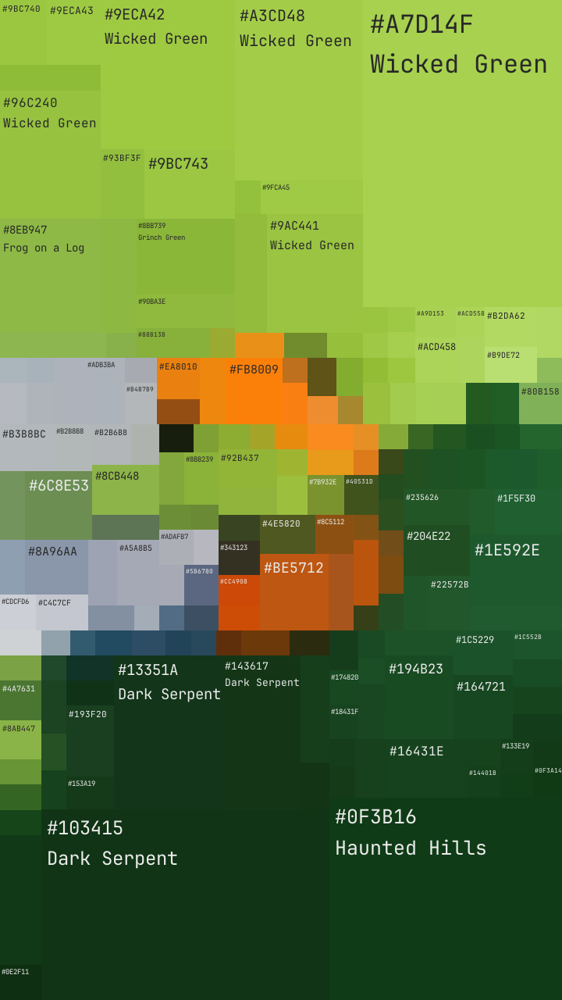

# colorist

| [input] | [output] |
|-------|--------|
|  |  |

## usage

```bash
> make build
> ./bin/colorist --input <image> --output <result>
```
## install (macos, apple silicon)

grab the latest `colorist-<version>-arm64.dmg` from [Releases](../../releases)

then remove the app from quarantine:

```bash
xattr -dr com.apple.quarantine /Applications/colorist.app
```
