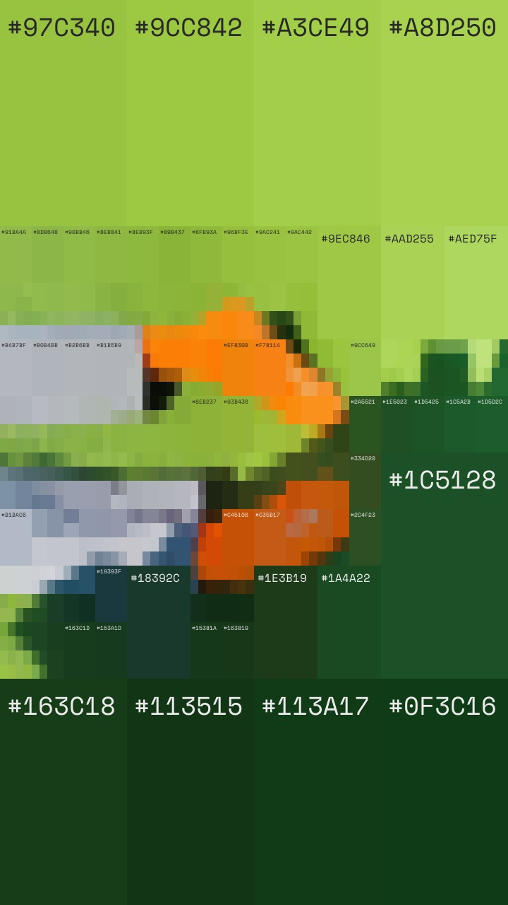

# colorist

| [input] | [output] |
|-------|--------|
|  |  |

## usage

```bash
> make build
> ./bin/colorist --input <image> --output <result>
```

### : web

```bash
make web
```

(runs on :8080)

### : desktop

```bash
make desktop
```

(run binary from desktop/build/bin)

## install (macos, apple silicon)

grab the latest `colorist-<version>-arm64.dmg` from [Releases](../../releases), open it, and drag **colorist** into **Applications**.

```bash
xattr -dr com.apple.quarantine /Applications/colorist.app
```
